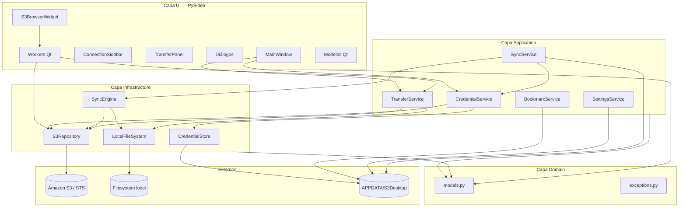
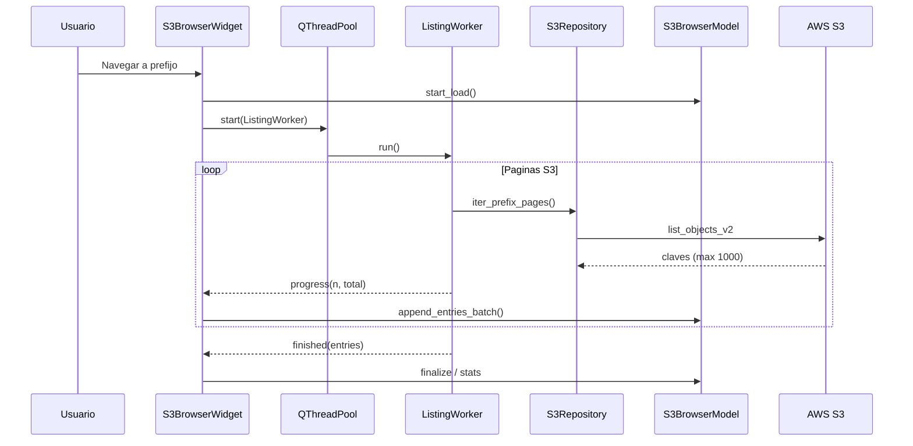

# S3 Desktop — Información técnica

Documento de referencia sobre arquitectura, stack tecnológico y módulos del proyecto **app-s3** (S3 Desktop).

---

## Resumen

| Atributo | Valor |
|----------|-------|
| Nombre del paquete | `app-s3` |
| Versión | `0.1.0` |
| Lenguaje | Python ≥ 3.11 |
| Plataforma objetivo | Windows (escritorio) |
| Paradigma UI | Modelo-Vista con capas de dominio/aplicación/infraestructura |
| Punto de entrada | `app_s3.__main__:main` → `bootstrap.run()` |
| Gestor de dependencias | [uv](https://docs.astral.sh/uv/) |
| Build backend | setuptools (`src/` layout) |

S3 Desktop es un cliente gráfico para Amazon S3 que cifra credenciales localmente, permite explorar buckets, transferir archivos y ejecutar jobs de sincronización programada entre disco local y prefijos S3.

---

## Stack tecnológico

### Frameworks y librerías principales

| Librería | Versión mínima | Rol en el proyecto |
|----------|----------------|-------------------|
| **PySide6** | 6.6 | Interfaz gráfica (Qt 6): ventanas, widgets, modelos, hilos (`QThreadPool`, `QRunnable`, señales/slots) |
| **boto3** | 1.34 | SDK AWS: cliente S3, STS, operaciones de listado, subida, descarga y borrado |
| **botocore** | (transitiva) | Configuración de reintentos, excepciones `ClientError`, paginadores S3 |
| **cryptography** | 42 | Cifrado simétrico Fernet del blob de credenciales |
| **argon2-cffi** | 23 | Hash Argon2id de la contraseña maestra (verificación sin almacenar texto plano) |
| **pydantic** | 2 | Modelos de dominio tipados, validación y serialización JSON |
| **APScheduler** | 3.10 | Planificador en background para jobs de sync (cron e intervalos) |
| **platformdirs** | 4 | Resolución del directorio de datos de usuario (`%APPDATA%`) |

### Librerías de la biblioteca estándar relevantes

- `pathlib`, `json`, `logging`, `threading`, `hashlib`, `base64`, `os`, `dataclasses`, `enum`, `uuid`, `datetime`

### Herramientas de desarrollo

| Herramienta | Uso |
|-------------|-----|
| **pytest** / **pytest-qt** | Pruebas unitarias e integración con Qt |
| **moto[s3]** | Mock del API S3 en tests |
| **ruff** | Linter y formateo (PEP 8, imports) |
| **mypy** | Tipado estático (configurado, uso opcional) |
| **PyInstaller** | Empaquetado del ejecutable Windows |

---

## Arquitectura

El código sigue una organización en capas dentro de `src/app_s3/`:



### Flujo de arranque

1. `__main__.py` invoca `bootstrap.run()`.
2. Se crea `QApplication`, tema Fusion, icono y estilos (`theme.py`).
3. `CredentialStore` comprueba si es primer uso.
4. `UnlockDialog` pide contraseña maestra → `setup()` o `unlock()`.
5. `MainWindow` recibe el store desbloqueado y compone sidebar, explorador y panel de transferencias.

---

## Estructura de directorios

```
app_s3/
├── docs/                          # Documentación
├── scripts/
│   └── s3desktop_entry.py         # Entrada para PyInstaller
├── src/app_s3/
│   ├── __main__.py                # CLI entry point
│   ├── bootstrap.py               # Wiring y arranque
│   ├── config/
│   │   └── paths.py               # Rutas APPDATA
│   ├── domain/
│   │   ├── models.py              # Entidades Pydantic
│   │   └── exceptions.py          # Jerarquía de errores
│   ├── application/               # Casos de uso / servicios
│   ├── infrastructure/            # AWS, FS, cifrado, sync
│   ├── ui/                        # PySide6
│   │   ├── dialogs/
│   │   ├── widgets/
│   │   ├── models/                # QStandardItemModel + proxy
│   │   ├── workers/               # QRunnable background
│   │   ├── theme.py
│   │   └── resources.py
│   └── assets/                    # Iconos (PNG, ICO)
├── tests/unit/
├── pyproject.toml
└── S3Desktop.spec                 # Spec PyInstaller (generado)
```

---

## Capa Domain

### `domain/models.py`

Modelos Pydantic (`BaseModel`) que representan el vocabulario del negocio:

| Modelo | Descripción |
|--------|-------------|
| `CredentialProfile` | Perfil AWS (alias, keys, región, endpoint opcional) |
| `BucketBookmark` / `BookmarksStore` | Buckets favoritos por cuenta |
| `AppSettings` | Preferencias (cuenta predeterminada) |
| `S3ListingEntry` | Elemento de listado (carpeta virtual o objeto) |
| `TransferTask` | Tarea de subida/descarga manual |
| `SyncJob` / `SyncJobsStore` | Job de sincronización y persistencia |
| `SyncAction` / `SyncResult` | Acciones del diff y resultado de ejecución |

Enums: `SyncDirection`, `ConflictPolicy`, `DeletePolicy`, `TransferDirection`, `TransferStatus`.

### `domain/exceptions.py`

| Excepción | Uso |
|-----------|-----|
| `AppS3Error` | Base |
| `CredentialError` / `UnlockError` | Credenciales y contraseña maestra |
| `S3OperationError` | Fallos boto3/S3 |
| `SyncError` | Sincronización |

---

## Capa Application (servicios)

Orquestan reglas de aplicación sin dependencias directas de Qt.

| Módulo | Clase | Responsabilidad |
|--------|-------|-----------------|
| `credential_service.py` | `CredentialService` | CRUD de perfiles; validación vía STS antes de guardar; fábrica de `S3Repository` |
| `bucket_service.py` | `BookmarkService` | Persistencia JSON de bookmarks por `credential_id` |
| `settings_service.py` | `SettingsService` | Cuenta predeterminada; reglas al eliminar perfiles |
| `transfer_service.py` | `TransferService` | Cola de `TransferTask`; ejecuta upload/download con callbacks de progreso |
| `sync_service.py` | `SyncService` | CRUD de jobs; `BackgroundScheduler`; ejecución manual y programada |

---

## Capa Infrastructure

| Módulo | Clase | Responsabilidad |
|--------|-------|-----------------|
| `credential_store.py` | `CredentialStore` | Salt aleatorio, verifier Argon2, derivación PBKDF2-HMAC-SHA256 → clave Fernet; archivo `credentials.enc` |
| `s3_repository.py` | `S3Repository` | Wrapper boto3: `list_buckets`, `list_prefix`, `iter_prefix_pages`, upload/download con progreso, delete, rename, create_folder |
| `sync_engine.py` | `SyncEngine` | Diff local↔S3; políticas de conflicto y dirección; ejecuta acciones |
| `local_fs.py` | `LocalFileSystem` | Escaneo recursivo, creación de directorios padre |
| `log_timing.py` | helpers | Logging de tiempos y contexto de hilo para diagnóstico |

### Integración AWS (boto3)

- **S3 client**: listado paginado (`list_objects_v2`), transferencias multipart vía callbacks.
- **STS client**: `GetCallerIdentity` para validar credenciales al alta/edición.
- **Config**: reintentos estándar (`max_attempts: 5`).
- Soporta **endpoint URL custom** (S3-compatible, MinIO, etc.).

### Listado S3 de alto volumen

- Paginación nativa S3 (1000 claves por página).
- `ListingWorker` (`QRunnable`) consume `iter_prefix_pages` en hilo de pool Qt.
- El modelo `S3BrowserModel` recibe lotes (`append_entries_batch`) para no bloquear la UI.
- Filtro por nombre vía `S3BrowserFilterProxy` (aplicado con botón, no en cada tecla).

---

## Capa UI (PySide6)

### Ventana y widgets

| Módulo | Componente | Función |
|--------|------------|---------|
| `main_window.py` | `MainWindow` | Layout principal (`QSplitter`), wiring de señales, operaciones S3 |
| `connection_sidebar.py` | `ConnectionSidebar` | Lista de cuentas y buckets bookmarked |
| `s3_browser_widget.py` | `S3BrowserWidget` | Tabla explorador, barra de ruta, filtro, drag-and-drop upload |
| `transfer_panel.py` | `TransferPanel` | Lista de transferencias en curso |
| `loading_overlay.py` | `LoadingOverlay` | Overlay de carga sobre la grilla |

### Diálogos

| Módulo | Diálogo |
|--------|---------|
| `unlock_dialog.py` | Contraseña maestra (primer uso / desbloqueo) |
| `credential_dialog.py` | Alta/edición de cuenta AWS |
| `add_bucket_dialog.py` | Añadir bucket a favoritos |
| `sync_job_dialog.py` | Configuración de jobs de sync |

### Modelos Qt

| Módulo | Clase | Función |
|--------|-------|---------|
| `s3_browser_model.py` | `S3BrowserModel` | `QStandardItemModel` con columnas check/nombre/tamaño/fecha; caché de conteos |
| `s3_browser_proxy.py` | `S3BrowserFilterProxy` | `QSortFilterProxyModel`; filtro por `ROLE_SEARCH_NAME` |

### Workers (concurrencia UI)

| Módulo | Clase | Función |
|--------|-------|---------|
| `listing_worker.py` | `ListingWorker` | Listado S3 async; señales `progress`, `finished`, `failed` |
| `transfer_worker.py` | `TransferWorker`, `TransferWorkerPool` | Transferencias en pool (máx. 3 hilos) |

### Presentación

| Módulo | Función |
|--------|---------|
| `theme.py` | Hoja de estilos Qt (Fusion + QSS personalizado) |
| `resources.py` | Icono de aplicación vía `importlib.resources` (`assets/app_icon.png`) |

---

## Persistencia de datos de usuario

Rutas definidas en `config/paths.py` usando `platformdirs.user_data_dir`:

| Archivo / carpeta | Contenido |
|-------------------|-----------|
| `%APPDATA%\S3Desktop\credentials.enc` | Blob Fernet con JSON de perfiles |
| `%APPDATA%\S3Desktop\.salt` | Salt para derivación de clave |
| `%APPDATA%\S3Desktop\.verifier` | Hash Argon2 de contraseña maestra |
| `%APPDATA%\S3Desktop\bookmarks.json` | Bookmarks de buckets |
| `%APPDATA%\S3Desktop\settings.json` | Preferencias de usuario |
| `%APPDATA%\S3Desktop\sync_jobs.json` | Definición de jobs de sync |
| `%APPDATA%\S3Desktop\logs\` | Logs por job (`sync_{id}.log`) |

Los JSON de configuración usan `model_dump_json` / `model_validate` de Pydantic v2.

---

## Seguridad

| Aspecto | Implementación |
|---------|----------------|
| Contraseña maestra | Nunca persistida; solo hash Argon2id |
| Clave de cifrado | Derivada con PBKDF2-HMAC-SHA256 (600 000 iteraciones) + salt |
| Credenciales AWS | Cifradas en reposo con Fernet (`cryptography`) |
| Sesión de app | `CredentialStore.lock()` al cerrar ventana; memoria limpia de Fernet |
| Validación | STS antes de guardar perfiles; desbloqueo fallido → `UnlockError` |

---

## Concurrencia y rendimiento

| Área | Estrategia |
|------|------------|
| Listado S3 | `QThreadPool` + `ListingWorker`; población por lotes (~200 filas) |
| Transferencias | Pool dedicado (3 workers) con progreso por señales Qt |
| Sync programado | `BackgroundScheduler` (APScheduler) en hilo daemon |
| Filtro UI | Aplicación explícita (botón/Enter); proxy optimizado; conteos cacheados |
| Diagnóstico | `log_timing.py` + logs INFO en repositorio y modelo |

---

## Empaquetado

Ver también `README.md` (sección *Empaquetado Windows*).

- **PyInstaller** con entrada `scripts/s3desktop_entry.py`.
- Icono del `.exe`: generar con `scripts/generate_app_icon.py` (ICO cuadrado 16–256 px) y embeber vía `S3Desktop.spec` (`ICON_PATH`).
- Salida: `dist/S3Desktop/S3Desktop.exe` (modo one-folder).
- Spec reutilizable: `S3Desktop.spec`.

---

## Tests

Ubicación: `tests/unit/`

| Archivo | Ámbito |
|---------|--------|
| `test_credential_store.py` | Cifrado, setup, unlock, lock |
| `test_settings_service.py` | Cuenta predeterminada y reglas de borrado |
| `test_sync_engine.py` | Diff y políticas de sincronización |

Ejecución:

```powershell
uv sync --group dev
uv run pytest
uv run ruff check src tests
```

---

## Diagrama de secuencia: explorar carpeta S3



---

## Referencias cruzadas

- Guía funcional para usuarios: [`funcionalidades.md`](funcionalidades.md)
- Instalación, ejecución y empaquetado: [`../README.md`](../README.md)
